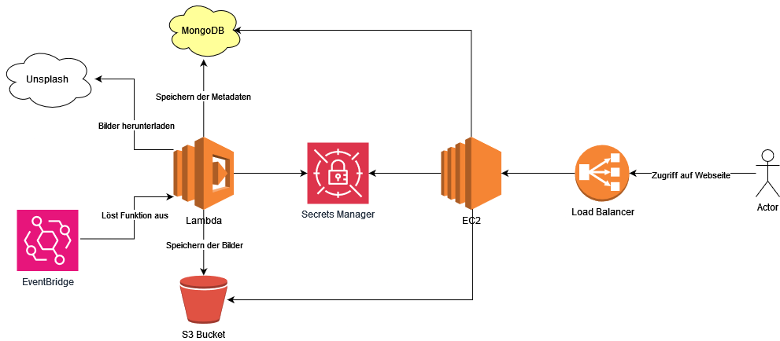

# Praktische Abschlussarbeit

[TOC]

## Projektbeschrieb

Die Abschlussarbeit welche im Rahmen des Modules 364 bearbeitet wurde, hatte das Ziel, eine Webseite zu kreieren, welche Bilder anzeigt und deren Metadaten darstellt. 

Die Logik dahinter ist allerdings einiges Komplizierter. So wurden unter anderem externe Services aber hauptsächlich AWS spezifische Funktionalitäten zu gebrauch gemacht:

<div style="text-align: center;">
    <figure>
        
        <figcaption>Komponentendiagramm </figcaption>
    </figure>
</div>

Prinzipiell lässt sich der ganze Vorgang in zwei Teile unterteilen; die Lambdafunktion und der Webserver. Diese umfassen die Logik für die Bildverarbeitung und deren Darstellung. Während die spezifischen Services und Funktionen zu den entsprechenden Komponenten in den folgenden Abschnitten genauer erläutert werden, folgt nun eine Übersicht wie die Applikation funktionert:

In einem zwei Minuten Takt, welcher durch einen Cron-Job ausgelöst wird, wird die Lambdafunktion von Cloudwatch gestartet. Die Lambdafunktion beginnt dann, zuerst die neusten Anmeldeinformationen (Credentials) aus dem Secrets Manager zu holen. Mit der von Unsplash zur verfügung gestellten API, wird ein zufällig ausgewähltes Bild heruntergeladen im Format "regular" welches einer Breite von 1080 Pixel entspricht. Bevor das Bild aber im S3 Bucket persistent gespeichert wird, ruft die Lambdafunktion den "Rekognition" Dient auf, welcher das Bild analysiert. Als Resultat erhalten wir eine von künstlicher Intelligenz ausarbeitete Bildbeschreibung. Die 5 Merkmale mit der grössten Konfidenz sowie die Metadaten (Unsplash Id des Bildes, Beschreibung des Bildes und Benutzername des Fotografs) welche wir ebenfalls von Unsplash erhalten, werden anschliessend mithilfe der MongoAPI auf eine MongoDB geschrieben. Diese NoSQL Datenbank erlaubt es, eine freiere Wahl der Entitäten zu gewährleisten. Das heisst, die Daten folgen in der Regel keiner strengen Richtlinie, man kann also beliebige Daten speichern. Das erlaubt es uns, in Zukunft mehr oder andere Metadaten zu speichern. Ist das speichern der Metadaten erfolgreich, wird das Bild im S3 Bucket gespeichert und die Lambdafunktion wird beendet. 
Der Webserver welcher auf einer EC2 Instanz läuft, bezieht sich ebnfalls die Anmeldeinformationen aus dem Secrets Manager und greift mit diesen per MongoAPI auf die MongoDB zu. Anschliessend wird im S3 Bucket nachgeschaut, ob die Bild Id welche von den Metadaten bezogen wurde, auch im S3 Bucket vorliegt, wenn ja, wird das Bild mit den entsprechenden Metadaten angezeigt. 
Schliesslich sieht der Benutzer alle zwei Minuten ein neues Bild mit deren Metadaten auf einer Homepage. 

---
## Vorgehen 

0. secrets manager 
1. Mongodb erstellen (ip access beachten)
2. S3 bucket erstellen (public access konfigurieren sodass webseite davon beziehen kann)
3. lambda layer erstellen (beinhaltet axios, mongodb => dependencies für lambda)
4. lambda funktion erstellen (node 20.x)
5. ec2 webserver erstellen und dynamisch inhalt von s3 und mongodb laden
6. cloud watch trigger alle 2 minuten
7. load balancer
8. hosted zone (subdomain)  

## AWS Secrets Manager

Damit die Credentials für die jeweiligen Services nicht hardcodiert werden müssen, wird der `AWS Secrets Manager` verwendet. Dieser erlaubt es, zentralisiert Key/Value-Pairs zu speichern und diese bspws. in EC2 oder Lambda zu verwenden.

AWS Secrets Manager => Store a new secret => Other type of secret

Damit die Secrets auch von EC2 oder Lambda ausgelesen werden können, müssen entsprechende Berechtigungen der `Lab Role` zugewiesen werden. Hierbei existieren verschiedene Möglichkeiten um Berechtigungen zu erteilen. Eine Möglichkeit ist es, über das `Identity and Access Management (IAM)` der Rolle den Zugriff für den Secrets Manager zu erteilen. Leider geht das aufgrund der Benutzerberechtigung der AWS Umgebung im Learner Lab nicht. Bedeutet, dass ich mit meinem Account keine Berechtigungen im IAM verteilen kann (so hat es zumindest während der Bearbeitung der Aufgabe ausgesehen). Desweiteren gibt es die Möglichkeit via `AWS Secrets Manager` bei jedem Schlüssel eigene Berechtigungen festzulegen. Dies kann einfach mit folgendem JSON unter `Resource permissions` beim jeweiligen Key angegeben werden:

```JSON
{
    "Version": "2012-10-17",
    "Statement": [
        {
            "Effect": "Allow",
            "Principal": {
                "AWS": "arn:aws:iam::561824754533:role/LabRole"
            },
            "Action": "secretsmanager:GetSecretValue",
            "Resource": "*"
        }
    ]
}
```

Dabei muss der `ARN` von der Rolle angegeben werden, welche die Berechtigung `GetSecretValue`erhalten soll. In meinem Fall ist das die `LabRole`. 

Das angeben der Berechtigung wird für jeden Secret wiederholt. 

Schliesslich habe ich die folgenden Schlüsselpaare

```
MONGODB_CLUSTER
MONGODB_PASSWORD
MONGODB_USERNAME
MONGODB_COLLECTION_NAME
MONGODB_DATABASE_NAME
S3_BUCKET_NAME
UNSPLASH_ACCESS_KEY
```

## Mongodb 

Bei der MongoDB gibt es nicht viel zu beachten. Nebst einer leeren Instanz musste nur noch der `Network access` konfiguriert werden. Bei dem wurde eingestellt, dass alle IP-Adressen zugriff auf die DB besitzten. Natürlich werden immernoch Anmeldeinformationen verlangt, doch wird die Firewall somit etwas entschärft. Der Grund dafür ist, dass die Services welche die MongoDB benötigen, einer öffentlichen IP zugewiesen sind. Diese kann sich immer wieder ändern (wenn nicht expliziert definiert) was dazu führen würde, dass bei jeder IP änderung der Netowrk access auf die neue IP angepasst werden müsste. Dies wird mit dem setzen von der IP-range `0.0.0.0/0` umgangen, birgt aber ein höheres Sicherheitsrisiko. Da es sich hierbei um keine produktive Umgebung handelt, ist dies also kein Problem.

## S3 Bucket

Der Bucket muss so konfiguriert werden, dass er erlaubt, Bilder im Internet öffentlich zu machen. Entweder kann man Global festlegen, dass jedes Bild publiziert wird oder man entscheidet sich jeweils genau, welches öffentlich gemacht werden soll. Ich habe mich für letzteres entschieden, um mehr Kontrolle über die Inhalte zu haben. Ich möchte z.B. nicht ein persönliches Bild hochladen und dieses automatisch online haben...
Damit dies bewerkstelligt werden konnte, mussten die ACLs aktiviert werden und `Block all public access` abgewählt werden. Diese Einstellungen erlauben, dass Berechtigungen einzeln auf den jeweiligen Bildern gesetzt werden können. In unserem Fall ein Bild also öffentlich zu machen. Desweiteren wird so erlaubt, dass wir über die Lambdafunktion die Berechtigungen auf ein Bild überhaupt setzten können. 

## Lambda  

Ist die MongoDB erstellt, deren Credentials im Secrets Manager eingetragen und der Bucket konfiguriert. Kann der zweite Teil, das erstellen der Lambda Funktion angegangen werden. 

Die folgende Lambda-Funktion basiert auf Node.js 20.x. Damit diese mit der Unsplash-API und MongoDB-API arbeiten kann, benötigt sie dependencies. Diese sind nicht direkt in der Laufzeitumgegbund integriert und müssen somit manuell hinzugefügt werden. Dies kann aber mithilfe einiger Online-Ressourcen relativ einfach implementiert werden. Dafür benötigt man ein sogenanntes Lambda-Layer.

Während dem bearbeiten der Aufgabe habe ich mir überlegt, ob es nicht sinnvoller gewesen wäre, eine andere Entwicklungsumgebung wie bspws. C# oder Python zu verwenden, da dort womöglich die benötigten Libraries/Dependencies bereits beinhaltet werden. Allerdings wird in [diesem](https://docs.aws.amazon.com/lambda/latest/dg/lambda-runtimes.html) Artikel erwähnt, dass der Benutzer selbst zu den benötigten Abhängigkeiten schauen muss. Welche aber bereits von Lambda selbst integriert sind, habe ich leider nicht gefunden. Somit spielt es meines Erachtens keine Rolle, welche Umgebung verwedent wird, da überall Dependencies/Libraries als Layer hinzugefügt werden müssen. 

### Lambda Layer

Das Lambda Layer stellt der zugehörigen Lambda-Funktion benötigte Dependencies bereit. Damit die Dependencies auf AWS hochgeladen werden können, müssen diese zuerst auf dem lokalen Rechner heruntergeladen und gezippt werden.

1. Lokalen order erstellen
2. Im Ordner Befehle `npm init -y`, `npm install axios mongodb` ausführen
3. Lokalen Ordner zu .zip machen

Somit haben wir die Dependencies/Libraries in einem zip-Format, welches von Lambda gelesen werden kannn.

Die Einbindung erfolgt wie folgt:

1. Auf die Lambda-Seite navigieren
2. `Layers` auswählen
3. Ein neues Layer erstellen (create layer)
4. Dieses Konfigurieren indem die Laufzeit angegeben wird und das Zip hochgeladen wird.

### Lambda Function

Erstellen der Lambda Funktion:

1. Lambda Seite navigieren
2. `Functions` reiter anwhälen
3. Create function 
4. `Nodejs 20.x` als Umgebung auswählen
5. `Change default execution role` die LabRole auswählen. 

Das auswählen der execution role umfasst zwei Gründe; erstens kann die Funktion nur erstellt werden, wenn eine Rolle angegeben wird, welche Berechtigung hat, auf Cloud Watch (logging service) zu schreiben. Zweitens greifen wir in der Funktion auf den API-Dienst von MongoDB zu. Dafür werden Credentials benötigt welche im Secrets Manager definiert sind. Damit diese ausgelesen werden können, haben wir bei den jeweiligen Secrets im SecretsManager angegeben welche Rollen auf die Ressourcen Zugriff haben. Da dies die LabRole ist, wird diese selektiert. 

Da die benötigten Dependencies nun vorhanden sind, wird die Lambda-Funktion erstellt, welche das Bild von Unsplash in den S3 Bucket herunterlädt und die Metadaten in MongoDB speichert.

Unter `Layers` wird der vorherig erstellte Layer hinzugefügt. Hierbei wird das Layer anhand des ARN (eindeutige ID) ausgewählt, dieser findet sich bei der Detailansicht des Lambda Layers. 

Der [Code]() wird anschliessend in das `index.mjs` geschrieben und muss mit dem Button `Deploy` gespeichert werden. 

Zu beachte gilt noch, dass die Timeout Dauer erhöht wird. Durch das Fetchen von Unsplash und den sonstigen Operaionen kann es sein, dass die Lambdafunktion länger als drei Sekunden daurt und in einem Timeout endet. Dies kann über Configruation => General configuration angepasst werden. Ich verwende 30s.

Bevor fortgefahren wird mit der EC2 Instanz welche den Webserver zur Verfügung stellt, wird ein Test durchgeführt welcher mit dem gleinchamigen Button ausgeführt werden kann. Der Test Event reicht mit der Standardkonfiguration aus und benötigt nur einen Namen. Ein erfolgreicher Test gibt einen HTTP Code 200. Zudem haben wir ein öffentlich einsehbares Bild im Bucket und auf MongoDB den MetadatenEintrag gemäss Anforderungen.

## EC2 Webserver

Für das erstellen der Instanz wird eine [Cloud-Init]() Datei verwendet. 

Konfiguriert wurde folgendes

1. Ubuntu 22.04
2. Neues Key Pair 
3. Neue Security group
4. Selektieren der IAM 
5. Hochladen des Cloud-Init

Ubuntu 22 wird verwendet, da einige Dependencies nicht auf dem neues Ubuntu 24 funktionieren. Ein neues Schlüsselpaar wurde definiert, um die praktische Prüfung von den anderen Aufgaben zu trennen. Weiter wurde eine neue `Security Group` erstellt, welche als Outbound-Rule alles zulässt (0.0.0.0/0) und als Inbound-Rule SSH Port 22, HTTP Port 80 und HTTPS Port 443. Wir verwenden zwar kein HTTPS da wir kein SSL-Zertifikat besitzten, doch trifft man beim Zugriff auf die Webseite schneller auf den geschlossenen Port als wenn man auf den Timeout wartet...
Sehr wichtig ist, wie bereits bei der Lambdafunktion definiert, dass auswählen einer Rolle, welche den Zugriff auf den Secrets Manager hat. Diese wurde ebenfalls im SecretsManger bei den jeweiligen Secrets angegeben und muss nun selektiert werden. Die EC2 Instanz läuft anschliessend mit dieser Rolle und erlaubt das auslesen der Schlüsselpaare. 

