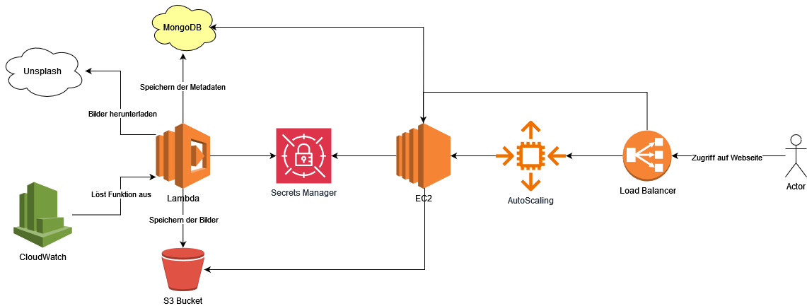

# Praktische Abschlussarbeit

[TOC]

## Projektbeschrieb

Die Abschlussarbeit, welche im Rahmen des Moduls 364 bearbeitet wurde, hatte das Ziel, eine Webseite zu kreieren, die Bilder anzeigt und deren Metadaten darstellt.

Die Logik dahinter ist allerdings einiges komplizierter. So wurden unter anderem externe Services, aber hauptsächlich AWS-spezifische Funktionalitäten, zu Gebrauch gemacht.

<div style="text-align: center;">
    <figure>
        
        <figcaption>Komponentendiagramm </figcaption>
    </figure>
</div>

Prinzipiell lässt sich der ganze Vorgang in zwei Teile unterteilen: die Lambda-Funktion und der Webserver. Diese umfassen die Logik für die Bildverarbeitung und deren Darstellung. Während die spezifischen Services und Funktionen zu den entsprechenden Komponenten in den folgenden Abschnitten genauer erläutert werden, folgt nun eine Übersicht, wie die Applikation funktioniert:

In einem Zwei-Minuten-Takt, welcher durch einen Cron-Job ausgelöst wird, wird die Lambda-Funktion von CloudWatch gestartet. Die Lambda-Funktion beginnt dann, zuerst die neusten Anmeldeinformationen (Credentials) aus dem Secrets Manager zu holen. Mit der von Unsplash zur Verfügung gestellten API wird ein zufällig ausgewähltes Bild im Format "regular", welches einer Breite von 1080 Pixeln entspricht, heruntergeladen. Bevor das Bild jedoch im S3 Bucket persistent gespeichert wird, ruft die Lambda-Funktion den "Rekognition"-Dienst auf, welcher das Bild analysiert. Als Resultat erhalten wir eine von künstlicher Intelligenz erstellte Bildbeschreibung. Die fünf Merkmale mit der grössten Konfidenz sowie die Metadaten (Unsplash-ID des Bildes, Beschreibung des Bildes und Benutzername des Fotografen), welche wir ebenfalls von Unsplash erhalten, werden anschliessend mithilfe der MongoAPI in eine MongoDB geschrieben. Diese NoSQL-Datenbank erlaubt eine freiere Wahl der Entitäten. Das heisst, die Daten folgen in der Regel keiner strengen Richtlinie, man kann also beliebige Daten speichern. Das erlaubt uns, in Zukunft mehr oder andere Metadaten zu speichern. Ist das Speichern der Metadaten erfolgreich, wird das Bild im S3 Bucket gespeichert und die Lambda-Funktion wird beendet.
Der Webserver, welcher auf einer EC2-Instanz läuft, bezieht ebenfalls die Anmeldeinformationen aus dem Secrets Manager und greift mit diesen per MongoAPI auf die MongoDB zu. Anschliessend wird im S3 Bucket nachgeschaut, ob die Bild-ID, welche von den Metadaten bezogen wurde, auch im S3 Bucket vorliegt. Wenn ja, wird das Bild mit den entsprechenden Metadaten angezeigt.
Schliesslich sieht der Benutzer alle zwei Minuten ein neues Bild mit den dazugehörigen Metadaten auf einer Homepage.

## Vorgehen 

Für die Durchführung dieser Aufgabe wird folgendermassen fortgefahren:

1. Secrets Manager (wird während der Bearbeitung der Aufgabe ständig aktualisiert)
2. MongoDB erstellen (IP Access beachten)
3. S3 Bucket erstellen (Public Access konfigurieren, sodass die Webseite darauf zugreifen kann)
4. Lambda Layer erstellen (beinhaltet Axios und MongoDB, also Dependencies für Lambda)
5. Lambda-Funktion erstellen (Node 20.x)
6. EC2-Webserver erstellen und dynamisch Inhalte von S3 und MongoDB laden
7. EventBridge-Trigger alle 2 Minuten
8. Load Balancer
9. Auto Scaling Service (für Redundanz)
10. Hosted Zone (Subdomain)

## AWS Secrets Manager

Damit die Credentials für die jeweiligen Services nicht hardcodiert werden müssen, wird der AWS Secrets Manager verwendet. Dieser erlaubt es, zentralisiert Key-Value-Pairs zu speichern und diese beispielsweise in EC2 oder Lambda zu verwenden.

AWS Secrets Manager => Store a new secret => Other type of secret

Damit die Secrets auch von EC2 oder Lambda ausgelesen werden können, müssen entsprechende Berechtigungen der Lab Role zugewiesen werden. Hierbei existieren verschiedene Möglichkeiten, um Berechtigungen zu erteilen. Eine Möglichkeit ist es, über das Identity and Access Management (IAM) der Rolle den Zugriff für den Secrets Manager zu erteilen. Leider geht das aufgrund der Benutzerberechtigung der AWS-Umgebung im Learner Lab nicht. Das bedeutet, dass ich mit meinem Account keine Berechtigungen im IAM verteilen kann (so hat es zumindest während der Bearbeitung der Aufgabe ausgesehen). Des Weiteren gibt es die Möglichkeit, via AWS Secrets Manager bei jedem Schlüssel eigene Berechtigungen festzulegen. Dies kann einfach mit folgendem JSON unter Resource permissions beim jeweiligen Key angegeben werden:

```JSON
{
  "Version" : "2012-10-17",
  "Statement" : [ {
    "Effect" : "Allow",
    "Principal" : {
      "AWS" : "arn:aws:iam::561824754533:role/LabRole"
    },
    "Action" : "secretsmanager:GetSecretValue",
    "Resource" : "*"
  }, {
    "Effect" : "Allow",
    "Principal" : {
      "AWS" : "arn:aws:iam::561824754533:role/EMR_EC2_DefaultRole"
    },
    "Action" : "secretsmanager:GetSecretValue",
    "Resource" : "*"
  } ]
}
```

Dabei muss der ARN von der Rolle angegeben werden, welche die Berechtigung GetSecretValue erhalten soll. In meinem Fall ist das die LabRole.

Das Angeben der Berechtigung wird für jedes Secret wiederholt.

Schliesslich habe ich die folgenden Schlüsselpaare:

```
MONGODB_CLUSTER
MONGODB_PASSWORD
MONGODB_USERNAME
MONGODB_COLLECTION_NAME
MONGODB_DATABASE_NAME
S3_BUCKET_NAME
UNSPLASH_ACCESS_KEY
```

<div style="text-align: center;">
    <figure>
        
        <figcaption>Konfiguration des Secrets für den S3 Bucket</figcaption>
    </figure>
</div>

Abschliessend erlaubt es der Secrets Manager einfach und konsequent, Anmeldeinformationen zu speichern. Der Vorteil dieses Services ist, dass er vollumfänglich von den anderen Services (Lambda, EC2) unterstützt wird und ein (mehr oder weniger) einfaches Auslesen ermöglicht. Des Weiteren können für den produktiven Betrieb Rollen und Berechtigungen spezifisch gesetzt werden, um die Sicherheit zu erhöhen.

## MongoDB 

Bei der MongoDB gibt es nicht viel zu beachten. Nebst einer leeren Instanz musste nur noch der Network access konfiguriert werden. Dabei wurde eingestellt, dass alle IP-Adressen Zugriff auf die Datenbank haben. Natürlich werden immer noch Anmeldeinformationen verlangt, doch wird die Firewall somit etwas entschärft. Der Grund dafür ist, dass die Services, die die MongoDB benötigen, einer öffentlichen IP zugewiesen sind. Diese IP kann sich immer wieder ändern (wenn nicht explizit definiert), was dazu führen würde, dass bei jeder Änderung der IP-Adresse der Network Access auf die neue IP angepasst werden müsste. Dies wird mit dem Setzen des IP-Ranges 0.0.0.0/0 umgangen, birgt aber ein höheres Sicherheitsrisiko. Da es sich hierbei um keine produktive Umgebung handelt, ist dies jedoch kein Problem.

<div style="text-align: center;">
    <figure>
        
        <figcaption>MongoDB für die praktische Prüfung</figcaption>
    </figure>
</div>

Als Alternative zur gewählten MongoDB wären alle anderen NoSQL-Datenbanken in Frage gekommen, da die Anforderung vorsieht, dass Metadaten einfach erweitert werden können. Dies lässt sich mit NoSQL-Datenbanken umsetzen, da diese keinen strengen Bedingungen folgen. Die möglicherweise optimale Technologie wäre jedoch AWS DynamoDB. Dies ist eine hauseigene NoSQL-Datenbank von AWS und integriert sich entsprechend gut mit den anderen von AWS gebrauchten Services. Trotzdem ist der Zugriff auf MongoDB einfach und benötigt im Prinzip nur die API. Da wir in Aufgabe 6 bereits mit MongoDB gearbeitet haben, ist es trivial, diese bereits implementierte Technologie wiederzuverwenden.

## S3 Bucket

Der Bucket muss so konfiguriert werden, dass Bilder im Internet öffentlich zugänglich gemacht werden können. Dabei kann entweder global festgelegt werden, dass jedes Bild veröffentlicht wird, oder man entscheidet sich jeweils genau, welches öffentlich gemacht werden soll. Ich habe mich für letzteres entschieden, um mehr Kontrolle über die Inhalte zu haben. Zum Beispiel möchte ich nicht, dass ein persönliches Bild automatisch online geht...
Damit dies bewerkstelligt werden konnte, mussten die ACLs aktiviert werden und Block all public access abgewählt werden. Diese Einstellungen erlauben es, dass Berechtigungen einzeln auf die jeweiligen Bilder gesetzt werden können. In unserem Fall bedeutet das, ein Bild öffentlich zu machen. Des Weiteren wird so ermöglicht, dass wir über die Lambda-Funktion die Berechtigungen für ein Bild setzen können.

<div style="text-align: center;">
    <figure>
        
        <figcaption>Einstellungen des S3 Buckets</figcaption>
    </figure>
</div>

Für das Speichern des Bildes gibt es mehrere Alternativen, die jeweils Vor- und Nachteile haben. Zum Beispiel wäre es möglich gewesen, MongoDB zu verwenden. Dies hätte die Speicherung und Abfrage vereinfacht, ist jedoch suboptimal, da Bilder nicht direkt im JPG- oder PNG-Format gespeichert werden können. Stattdessen müssten sie entweder als binäre Daten oder mithilfe von GridFS in MongoDB-Dokumente aufgeteilt werden, um gespeichert zu werden. Ein Nachteil dabei ist eine erhöhte Latenz und somit Einbussen in der Performance, da die Bilder verarbeitet werden müssen.
Die womöglich sinnvollste Alternative wäre jedoch das Erstellen eines AWS Elastic File Systems. Dies ist ein Datenspeicher, der zwischen EC2-Instanzen geteilt wird und ebenfalls Daten persistent speichert. Ein Vorteil dabei ist, dass Daten einfach abrufbar sind und sogar mit Lambda-Funktionen kompatibel sind. Trotzdem habe ich mich für den S3 Bucket entschieden, da ich bereits einige Aufgaben mit S3 Buckets erledigt habe und dieser die Vorteile bietet, möglicherweise performanter zu sein, da er über HTTP/S anstatt über NFS eingebunden wird.
Schlussendlich wäre es auch möglich gewesen, Elastic Block Storage zu verwenden. Dies eignet sich jedoch aufgrund von Skalierungs- und Wartungsproblemen nicht so gut wie S3. Daher habe ich mich für die konventionelle Methode entschieden - mit S3 Bucket, Lambda-Funktion und EC2-Instanz.

## Lambda  

Nachdem die MongoDB erstellt, deren Credentials im Secrets Manager hinterlegt und der Bucket konfiguriert wurden, kann nun der zweite Teil angegangen werden: das Erstellen der Lambda-Funktion.

Die folgende Lambda-Funktion basiert auf Node.js 20.x. Um mit der Unsplash-API und der MongoDB-API arbeiten zu können, benötigt sie Dependencies. Diese sind nicht direkt in der Laufzeitumgebung integriert und müssen daher manuell hinzugefügt werden. Dies kann jedoch mithilfe einiger Online-Ressourcen relativ einfach implementiert werden, indem ein sogenanntes Lambda-Layer verwendet wird.

Während der Bearbeitung der Aufgabe habe ich darüber nachgedacht, ob es sinnvoller gewesen wäre, eine andere Entwicklungsumgebung wie etwa C# oder Python zu verwenden, da dort möglicherweise die benötigten Libraries/Dependencies bereits enthalten sind. Allerdings wird in [diesem](https://docs.aws.amazon.com/lambda/latest/dg/lambda-runtimes.html) Artikel erwähnt, dass der Benutzer selbst die benötigten Abhängigkeiten prüfen muss. Welche jedoch bereits von Lambda selbst integriert sind, habe ich leider nicht gefunden. Daher spielt es meiner Meinung nach keine Rolle, welche Umgebung verwendet wird, da überall Dependencies/Libraries als Layer hinzugefügt werden müssen.

### Lambda Layer

Das Lambda Layer stellt der zugehörigen Lambda-Funktion benötigte Dependencies bereit. Um die Dependencies auf AWS hochladen zu können, müssen diese zunächst auf dem lokalen Rechner heruntergeladen und in eine ZIP-Datei gepackt werden.

Hier sind die Schritte dazu:

1. Einen lokalen Ordner erstellen
2. Im Ordner die Befehle npm init -y und npm install axios mongodb ausführen
3. Den lokalen Ordner in eine ZIP-Datei packen

Auf diese Weise werden die Dependencies/Libraries im richtigen Format vorliegen, das von Lambda gelesen werden kann.

Die Einbindung in Lambda erfolgt wie folgt:

1. Zur Lambda-Konsole navigieren
2. Den Bereich Layers auswählen
3. Ein neues Layer erstellen ("Create layer")
4. Das Layer konfigurieren, indem die Laufzeit angegeben wird und die ZIP-Datei hochgeladen wird

<div style="text-align: center;">
    <figure>
        
        <figcaption>Konfiguration des Lambda Layers</figcaption>
    </figure>
</div>

### Lambda Function

Um die Lambda-Funktion zu erstellen, folge diesen Schritten:

1. Navigiere zur Lambda-Konsole
2. Wähle den Reiter Functions
3. Klicke auf Create function
4. Wähle Node.js 20.x als Laufzeitumgebung aus
5. Bei der Option Change default execution role wähle die LabRole aus

<div style="text-align: center;">
    <figure>
        
        <figcaption>Einstellungen der Lambdafunktion</figcaption>
    </figure>
</div>

Das Auswählen der Execution Role hat zwei Gründe: Erstens kann die Funktion nur erstellt werden, wenn eine Rolle angegeben wird, die Berechtigungen hat, auf CloudWatch (Logging Service) zu schreiben. Zweitens greifen wir in der Funktion auf den API-Dienst von MongoDB zu. Dafür werden Credentials benötigt, die im Secrets Manager definiert sind. Damit diese ausgelesen werden können, haben wir bei den jeweiligen Secrets im Secrets Manager angegeben, welche Rollen Zugriff auf die Ressourcen haben. Da dies die LabRole ist, wird diese ausgewählt.
Da die benötigten Dependencies nun vorhanden sind, wird die Lambda-Funktion erstellt, die das Bild von Unsplash herunterlädt und in den S3 Bucket speichert sowie die Metadaten in MongoDB ablegt.
Unter Layers wird der zuvor erstellte Layer hinzugefügt. Dazu wird der ARN (eindeutige ID) des Layers verwendet, der sich in der Detailansicht des Lambda Layers befindet.

<div style="text-align: center;">
    <figure>
        
        <figcaption>Konfiguration, um Layer an der Funktion anzubinden</figcaption>
    </figure>
</div>

Der [Code](/lambdafunction.js)  wird anschliessend in die Datei index.mjs geschrieben und muss mit dem Button Deploy gespeichert werden.
Es ist wichtig zu beachten, dass die Timeout-Dauer erhöht werden muss. Aufgrund des Fetchens von Unsplash und anderen Operationen könnte die Lambda-Funktion länger als drei Sekunden dauern und daher einen Timeout verursachen. Dies kann unter Configuration => General configuration angepasst werden. Ich verwende eine Timeout-Dauer von 30 Sekunden.
Bevor mit der Einrichtung der EC2-Instanz fortgefahren wird, sollte ein Test durchgeführt werden, der mit dem entsprechenden Button ausgeführt werden kann. Der Test-Event kann mit der Standardkonfiguration durchgeführt werden und benötigt lediglich einen Namen. Ein erfolgreicher Test gibt einen HTTP-Code 200 zurück. Zudem sollte ein öffentlich einsehbares Bild im Bucket vorhanden sein und in MongoDB der Metadateneintrag gemäss den Anforderungen gespeichert sein.

<div style="text-align: center;">
    <figure>
        
        <figcaption>Antwort des Tests i.O.</figcaption>
    </figure>
</div>

<div style="text-align: center;">
    <figure>
        
        <figcaption>Erster Eintrag von Metadaten in der MongoDB</figcaption>
    </figure>
</div>

<div style="text-align: center;">
    <figure>
        
        <figcaption>Öffentliches Bild im S3 Bucket</figcaption>
    </figure>
</div>

## EC2 Webserver

Für das Erstellen der Instanz wird eine [Cloud-Init](/cloud-init.yaml) Datei verwendet.

Konfiguriert wurde Folgendes:

1. Ubuntu 22.04 als Betriebssystem
2. Ein neues Key Pair wurde erstellt, um die praktischen Prüfungen von anderen Aufgaben zu trennen
3. Eine neue Security Group wurde erstellt, die als Outbound-Rule den Zugriff von allen IP-Adressen (0.0.0.0/0) erlaubt und als Inbound-Rule die Ports SSH (22), HTTP (80) und HTTPS (443) zulässt. Auch wenn HTTPS nicht verwendet wird, vermeidet diese Konfiguration unerwartete Timeout-Probleme beim Zugriff auf die Webseite
4. Es wurde die IAM-Rolle ausgewählt, die Zugriff auf den Secrets Manager hat, wie bereits für die Lambda-Funktion definiert. Diese Rolle ermöglicht es der EC2-Instanz, die erforderlichen Schlüsselpaare aus dem Secrets Manager auszulesen

Der Webserver läuft mithilfe von Apache und zeigt kontinuierlich die neuen Inhalte aus der MongoDB zusammen mit den jeweiligen Bildern an, die über ein PHP-Skript bereitgestellt werden.

Bei der Konfiguration der EC2-Instanz gab es einige Herausforderungen, insbesondere beim Auslesen der Secrets aus dem Secrets Manager. Verschiedene Ansätze wurden getestet:

1. Direktes Auslesen der Credentials aus dem Secrets Manager im MongoAPI Call. Dies garantiert stets aktuelle Secrets und wird alle zwei Minuten durch einen Cron Job aktualisiert
2. Abrufen der Secrets per Cron Job und Speichern als Umgebungsvariablen (ENV). Der MongoAPI Call greift dann auf diese ENV zu und ruft alle zwei Minuten die API ab. Hierbei muss sichergestellt werden, dass die Credentials stets aktuell sind
3. Ein Skript, das die Secrets aus dem Secrets Manager liest und direkt im gleichen Skript den API Call durchführt. Dieses Skript wird als Cron Job ausgeführt

Nur die letzte Methode hat funktioniert, wenn auch nicht optimal. Das Skript `credentials.sh` wird beim Erstellen der EC2-Instanz aufgerufen, um die Secrets aus dem Secrets Manager abzurufen und als ENV auf dem System zu speichern. Gleichzeitig wird der API Call initialisiert, der alle Minute (statt alle zwei Minuten, um immer auf dem neuesten Stand von S3 Bucket/MongoDB zu sein) die Metadaten aus der MongoDB abruft und in einer Datei speichert.

Ein Problem hierbei ist, dass Änderungen an den Secrets nicht automatisch übernommen werden. Die aktualisierten Daten werden durch ein PHP-Skript angezeigt, das das Bild aus dem S3 Bucket lädt und die entsprechenden Metadaten aus der Datei holt. Der Verbindungsstring für den S3 Bucket muss hierbei hartcodiert werden, da der Zugriff auf den Secrets Manager oder die ENV-Variablen nicht implementiert wurde.

Trotz der Funktionalität ist dieses Cloud-Init Skript nicht für den produktiven Einsatz geeignet. Die Verwaltung der Credentials bleibt eine grosse Herausforderung, die stets aktuell und sicher aufbewahrt werden müssen. Dennoch war es möglich, die Credentials aus dem Secrets Manager zu lesen und zu verwenden.

## Automatisieren mit Event Bridge

Da der Webserver nun funktioniert, möchten wir, dass alle zwei Minuten ein Bild von Unsplash heruntergeladen und verarbeitet wird. Dies kann sehr einfach mit Amazon EventBridge umgesetzt werden.

Hier sind die Schritte:

1. Navigiere zur Amazon EventBridge Konsole
2. Wähle Schedules
3. Klicke auf Create schedule
4. Unter Schedule pattern gib die Cron Expression `*/2 * * * * ?` ein, um festzulegen, dass die Regel alle zwei Minuten ausgeführt wird
5. Wähle als Target AWS Lambda aus
6. Wähle die entsprechende Lambda-Funktion aus
7. Wähle bei Action after schedule completion die Option NONE aus, da der Vorgang kontinuierlich laufen soll
8. Bei den Permissions wähle die LabRole aus, um der Regel die benötigten Berechtigungen zu geben

<div style="text-align: center;">
    <figure>
        
        <figcaption>Die nächsten Ausführzeiten des Events</figcaption>
    </figure>
</div>

## Load Balancer und AutoScaling

Mit der bisher umgesetzten Applikation werden alle zwei Minuten Bilder von Unsplash heruntergeladen und mit den jeweiligen Metadaten auf der Homepage angezeigt. In diesem Abschnitt wird ein Load Balancer und ein Auto Scaling Service erstellt. Diese Kombination ermöglicht es, stets eine gewünschte Anzahl von EC2-Instanzen laufen zu haben und die Last gleichmässig auf diese zu verteilen. Zudem werden die Instanzen in verschiedenen Availability Zones ausgeführt, was die Redundanz erhöht.

Der folgende Ablauf wird nicht im Detail dokumentiert, da dies bereits in der Aufgabe 06: Scaling ausführlicher beschrieben ist. Dennoch ist der Ablauf wie folgt:

1. Erstellen der Target Group:
    1. Gehe zu EC2
    2. Wähle Target Groups
    3. Klicke auf Create target group
    4. Wähle als Target Instances

<div style="text-align: center;">
    <figure>
        
        <figcaption>Einstellungen der Target Group</figcaption>
    </figure>
</div>

2. Konfigurieren des Load Balancers:
    1. Gehe zu EC2
    2. Wähle Load Balancer
    3. Klicke auf Create Load Balancer
    4. Wähle Application Load Balancer
    5. Konfiguriere die Availability Zones, in denen der Load Balancer laufen soll
    6. Passe die Security Groups entsprechend an
    7. Wähle die zuvor erstellte Target Group aus, um die Last auf die EC2-Instanzen zu verteilen

<div style="text-align: center;">
    <figure>
        
        <figcaption>Die selektierten Availability Zones für mehr Redundanz</figcaption>
    </figure>
</div>

<div style="text-align: center;">
    <figure>
        
        <figcaption>Zusammenfassung des Load Balancers</figcaption>
    </figure>
</div>

<div style="text-align: center;">
    <figure>
        
        <figcaption>Erreichbar: Der Webserver via Load Balancer</figcaption>
    </figure>
</div>

Bis zu diesem Zeitpunkt haben wir einen LoadBalancer mit einer öffentlich erreichbaren URI, doch zeigt diese auf immer die gleiche Instanz. Dies wollen wir nun ändern. 

3. Erstellen eines Launch Templates:
    1. Gehe zu EC2
    2. Wähle Launch Templates
    3. Konfiguriere das Launch Template ähnlich wie die zuvor erstellte EC2-Instanz

4. Definieren des Auto Scaling Services:
    1. Gehe zu EC2
    2. Wähle Auto Scaling Groups
    3. Wähle das zuvor erstellte Launch Template aus
    4. Wähle die gleichen Availability Zones wie beim Load Balancer aus
    5. Wähle Attach to an existing load balancer
    6. Wähle die entsprechende Target Group aus
    7. Aktiviere die Elastic Load Balancing Gesundheitsüberprüfungen
    8. Setze die Mindestanzahl von Instanzen auf 2

Sobald die Instanzen den Status "Healthy" erreichen, bleibt die Webseite über die URI des Load Balancers weiterhin erreichbar. Jetzt besteht eine gewisse Redundanz mit drei Instanzen (2 vom Auto Scaler, 1 manuell erstellt). Man kann sich immer auf die beiden Instanzen des Auto Scalers verlassen, es sei denn, es gibt einen weitreichenden AWS-Systemausfall, was jedoch sehr unwahrscheinlich ist.

<div style="text-align: center;">
    <figure>
        
        <figcaption>Drei gesunde Instanzen</figcaption>
    </figure>
</div>


## Hosted Zone 

Um den Webserver unter der Subdomain sebastian.m346.ch erreichbar zu machen, müssen wir eine Hosted Zone in AWS Route 53 erstellen und konfigurieren:

1. Gehe zu AWS Route 53
2. Wähle Create hosted zone
3. Gewünschte Subdomain angeben
4. Der Administrator der Domain muss die Nameserver (NS), die in der Route 53 Oberfläche angezeigt werden, informiert bekommen. Der Administrator delegiert dann alle Verbindungen zur Subdomain an unsere Hosted Zone, damit wir diese verwenden können
5. Nachdem die Hosted Zone erstellt und konfiguriert ist, erstelle einen DNS-Eintrag (record):
    1. Wähle den Typ Alias.
    2. Wähle den AWS Service, der automatisch konfiguriert werden soll.
    3. Wähle den Load Balancer, der mit deinem Webserver verbunden ist (praktischePruefungLB-121437075.us-east-1.elb.amazonaws.com).

Damit wird der Load Balancer unter der Subdomain sebastian.m346.ch erreichbar sein.

<div style="text-align: center;">
    <figure>
        
        <figcaption>Konfiguration der Subodmain in der Hosted Zone</figcaption>
    </figure>
</div>

Hat alles funktioniert, ist unser Webserver über die Seite `sebastian.m346.ch` aufrufbar. 

# Reflexion und Abschluss

Die Aufgabe erwies sich als komplexer als anfangs gedacht. Das Planen und Zusammenstellen ging ziemlich gut, da die vorherigen Aufgaben in diesem Modul alle gewisse Teile dieser Aufgabe beinhalteten. Es war also prinzipiell ein Zusammenstellen verschiedener Dienste und möglicher Verbesserungen oder zusätzlicher Funktionalitäten. Secrets Manager, Events Bridge oder Lambda Layer waren zusätzliche Konfigurationen, die Neuland für mich waren und entsprechend Zeit gekostet haben.

Wie bereits gesagt, war das mit Abstand Schwierigste das Handling der Credentials. Zum einen Berechtigungen zu erteilen, sodass Lambda oder EC2 diese auslesen können, zum anderen die Speicherung, Aktualisierung und schliesslich deren Verwendung. Die Implementierung in der Lambdafunktion finde ich gelungen; stets wenn diese ausgeführt wird, holt sie sich die neuen Anmeldeinformationen. Die Werte sind nicht hardcodiert und erlauben ein einfaches Austauschen der Variablen im Secrets Manager. Bei der EC2-Instanz ist dies leider nicht der Fall. Die Credentials werden zwar verwendet, doch habe ich es nicht geschafft, das Aktualisieren dieser in einen Cron-Job o.ä. zu integrieren. Hierbei bedarf es mehr technisches Know-how, um eine sicherere und besser wartbare Lösung zu kreieren.

Als weiteren Verbesserungspunkt sehe ich eine optimiertere Abfrage zwischen EC2 und dem S3 Bucket. Zurzeit werden alle Bilder auf einmal aus dem Bucket bezogen, was je nach Menge sehr viel Zeit beansprucht. Dies könnte am einfachsten optimiert werden, indem die Webseite "Seiten" bekommt. Dies würde garantieren, dass auf jeder Seite nur beispielsweise 10 Bilder geladen werden. Möchte man mehr sehen, muss man auf die nächste Seite wechseln. Eine weitere Möglichkeit wäre das lokale Speichern der Bilder. Dies wäre zwar schneller beim Anzeigen, würde jedoch die Architektur komplexer machen. Ähnliches gilt für das Holen der Metadaten. Der Cron-Job sorgt dafür, dass jede Minute alle Daten ausgelesen und gespeichert werden. Dies erzeugt, abhängig von den Daten, massive Performanceprobleme und müsste für den produktiven Betrieb ebenfalls überarbeitet werden. Am besten wäre es, genau wie bei den Bildern, nur die Metadaten abzurufen, die auch wirklich angezeigt werden.

Den restlichen Ablauf schätze ich als erfüllt ein. Durch die Verwendung verschiedener Services entsteht eine dezentralisierte und modulare Architektur, die beliebig skaliert oder ausgetauscht werden kann, ohne grosse Unterbrüche zu erleiden. Wenn beispielsweise die EC2-Instanzen gewartet werden müssen oder ausfallen, läuft das Herunterladen und Bearbeiten der Bildinformationen trotzdem weiter, da eine Lambdafunktion benutzt wird, welche unabhängig davon arbeiten kann. Weiter ist die Lambdafunktion kostengünstiger, da sie nicht ständig läuft im Vergleich zu einer EC2-Instanz. Da der Benutzer ständig auf die Website gelangen will, kommt man nicht um einen Webserver herum, der auf einer EC2-Instanz läuft. Um Redundanz und eine mögliche Downtime zu vermeiden, wurde auch ein Auto Scaling Service und Load Balancer integriert. Somit laufen stets mindestens zwei EC2-Instanzen in verschiedenen Availability Zones. Wird eine Instanz zu stark beansprucht, leitet der Load Balancer den Verkehr zur anderen Instanz um, was zu Leistungsverbesserungen führt.

Zusammenfassend bin ich also relativ zufrieden mit der Lösung. Sie weist redundante Aspekte für einen optimalen Betrieb auf und verfolgt einen modularen Ansatz. Es ist (teilweise) möglich, einen zentralisierten Credentials Manager zu verwenden, um die Anmeldeinformationen zuverlässig zu ändern, und es spart Kosten durch die Verwendung einer Lambdafunktion und einem S3 Bucket. Verbessert werden müssten jedoch die Verwaltung der Anmeldeinformationen und ein performanteres Holen und Abspeichern der Bilddateien, Metadaten sowie deren Anzeige auf der Webseite.